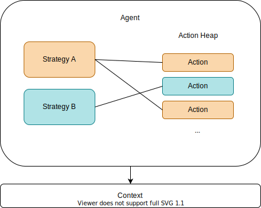

# Strategize

A generic, streamlined library for strategy-based
decision making in agents.

## Overview

### Context

Any `Agent` making decisions needs an environment
that enables it to make these decisions. This
essentially breaks down into two responsibilities:

- Offering the `Agent` details about the
  environment so that it can base its decisions
  on information from the outside
- Offering the `Agent` methods to interact with
  the environment
  
`Context` is a generic type-parameter so it can be
any class you provide, but we recommend following
this principles while modelling your `Context` class:

- The act of reading its state should not change its
  state
- The methods provided should be robust and have a
  predictable performance

### Composition of an Agent

The `Agent` class represents a single entity capable
of strategic actions. To make long-term decisions
an `Agent` can use any number of instances of the
`IStrategy` interface.

A `Strategy` therefore consists of any number of
instances of the `IAction` interface it considers
viable. Strategies and Actions can be freely
modeled.

### Lifecycle of an Action

Each time `Agent.Consider(IStrategy strategy)` is
called, all of its actions will be queried for a
new priority value. In this way strategies can be
updated independently from other strategies on an
agent.

Each time `Agent.Tick(TContext context)` is called
the following happens in order:

1. The action with the highest priority value
   from the last call of the 
   `Agent.Consider(IStrategy strategy)` will be
   selected as the next action (the action can
   remain the same as before)
2. If the action changed since the last tick:
   `Action.OnFinish(TContext context)` of the
   old action is called
3. If the action changed since the last tick:
   `Action.OnEnter(TContext context)` of the
   new action is called
4. Finally `Action.OnTick(TContext context)` is
   called
   
This means that if an action has the highest
priority when `Agent.Tick(TContext context)` is
called, it will always traverse the phases
`OnEnter`, `OnTick` and `OnFinish` in order.

Please note that the corresponding methods can be
called multiple times, because the action objects
are reused after their respective lifecycle.
   
